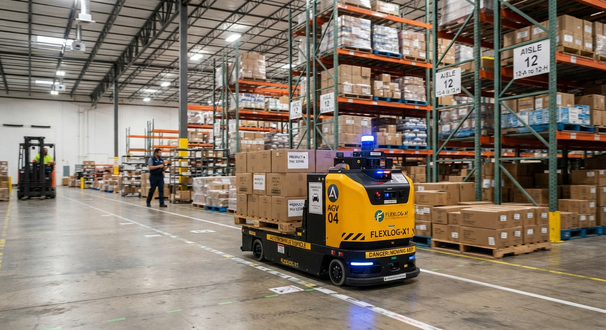

# Caramelo

**A differential-drive AGV simulation built with ROS 2 and Gazebo.**

<p align="center">
  
  
  
  
</p>

Caramelo is a personal project to design, simulate and control an Autonomous Guided Vehicle (AGV) for warehouse environments. It includes the robot description (URDF/Xacro), a velocity controller, and Gazebo simulation, with autonomous navigation planned for future releases.

<p align="center">
  
</p>

<p align="center"><em>Concept design of the Caramelo AGV.</em></p>

---

## Table of Contents

- [Features](#features)
- [Requirements](#requirements)
- [Installation](#installation)
- [Quick Start](#quick-start)
- [Packages](#packages)
- [Roadmap](#roadmap)
<!-- - [Contributing](#contributing) -->
<!-- - [License](#license) -->
<!-- - [Acknowledgements](#acknowledgements) -->

---

## Features

- Full robot description in URDF/Xacro, ready to spawn in Gazebo.
- Differential-drive controller built on `ros2_control`.
- Teleoperation with the keyboard for manual testing.
- Simulation-first workflow — no hardware required to get started.

---

## Requirements

| Requirement | Version |
|---|---|
| Ubuntu | 22.04 LTS (Jammy Jellyfish) |
| ROS 2 | Humble |
| Gazebo | Fortress (Ignition) |
| Build tool | `colcon` |

<!-- Install the additional packages used by the demo:

```bash
sudo apt update
sudo apt install \
  ros-humble-ros-gz \
  ros-humble-ros2-control \
  ros-humble-ros2-controllers \
  ros-humble-teleop-twist-keyboard
``` -->

---

## Installation

**1. Create a ROS 2 workspace** (skip if you already have one):

```bash
mkdir -p ~/caramelo_ws/src
cd ~/caramelo_ws/src
```

**2. Clone the repository:**

```bash
git clone https://github.com/richy-gs/caramelo_ws.git
```

**3. Install dependencies:**

```bash
cd ~/caramelo_ws
rosdep install --from-paths src --ignore-src -r -y
```

**4. Build the workspace:**

```bash
colcon build --symlink-install
```

**5. Source the workspace:**

```bash
source ~/caramelo_ws/install/setup.bash
```

> **Tip:** add that last line to your `~/.bashrc` so you don't have to repeat it in every terminal.

---

## Quick Start

Run each command in a **separate terminal**, and remember to source the workspace in all of them.

### Terminal 1 — Spawn the AGV in Gazebo

```bash
ros2 launch caramelo_description gazebo.launch.py
```

### Terminal 2 — Start the controller

```bash
ros2 launch caramelo_controller controller.launch.py
```

### Terminal 3 — Drive the robot with the keyboard

```bash
ros2 run teleop_twist_keyboard teleop_twist_keyboard \
  --ros-args \
  -p stamped:=true \
  -p frame_id:=base_link \
  -r cmd_vel:=/caramelo_controller/cmd_vel
```

Use `i`, `j`, `k`, `l` to move and `q` / `z` to adjust speed. Keep this terminal focused while driving.

<!-- > **Note:** the `stamped` parameter is not available in every `teleop_twist_keyboard` release shipped for Humble. If the node rejects it, drop `-p stamped:=true -p frame_id:=base_link` and make sure the controller is subscribing to `geometry_msgs/msg/Twist`. -->

---

## Packages

| Package | Description |
|---|---|
| `caramelo_description` | URDF/Xacro model, meshes and Gazebo launch files. |
| `caramelo_controller` | Differential-drive controller configuration and launch files. |

---

## Roadmap

- [x] Robot description and Gazebo simulation
- [x] Differential-drive controller
- [x] Keyboard teleoperation
- [ ] Odometry and sensor fusion
- [ ] SLAM and map building
- [ ] Autonomous navigation with Nav2
- [ ] Warehouse world with shelves and pallets
- [ ] Deployment on physical hardware

---

<!-- ## Contributing

Issues and pull requests are welcome. For larger changes, please open an issue first to discuss what you'd like to change.

---

## License

Distributed under the Apache License 2.0. See [`LICENSE`](LICENSE) for the full text.

```
Copyright 2026 Ricardo G.

Licensed under the Apache License, Version 2.0 (the "License");
you may not use this file except in compliance with the License.
You may obtain a copy of the License at

    http://www.apache.org/licenses/LICENSE-2.0
```

TODO: replace the copyright holder with your full name,
     and make sure <license>Apache-2.0</license> is set in every package.xml.

---

## Acknowledgements

- [ROS 2 Documentation](https://docs.ros.org)
- [Gazebo Simulator](https://gazebosim.org) -->